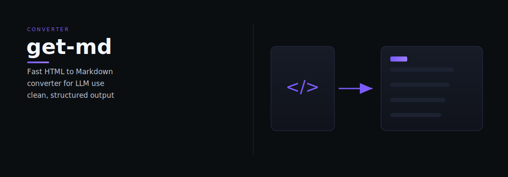

# get-md

get-md - A fast, lightweight HTML to Markdown converter optimized for LLM consumption. Uses proven parsing libraries to deliver clean, well-structured markdown with intelligent content extraction and noise filtering.

> One clear job, done well.

## Quick start

bash
npm install @nanocollective/get-md

typescript
import { convertToMarkdown } from "@nanocollective/get-md";

const result = await convertToMarkdown("https://example.com");
console.log(result.markdown);

Or use the CLI:

bash
npx @nanocollective/get-md https://example.com -o output.md

---

*get-md is part of the [OCAS Agent Suite](https://github.com/indigokarasu).*

---

---
## 📄 License
MIT License — see `LICENSE` for details.
